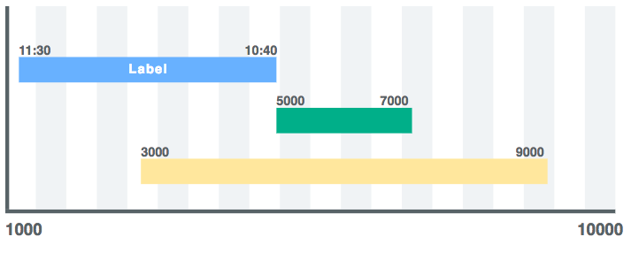

<div align="center">
  <br/>
  
  <br/>
  <br/>
  <p>
     SVG Timeline generator for Javascript<br/>
  </p>
  <br/>
</div>


---


## Install

`npm install thymeline --save`

or
`yarn add thymeline --save`

---

## Quick Guide
### Basic Usage

```
const events = [
  {
    start: 1000,
    stop: 5000,
    startLabel: '11:30',
    stopLabel: '10:40',
    label: 'eventlabel',
  },
  {
    start: 5000,
    stop: 7000,
  },
  {
    start: 3000,
    stop: 9000,
  },
];

const generator = new TimelineGenerator(1000, 10000, events);
let graph = generator.generate();

```

### Output

